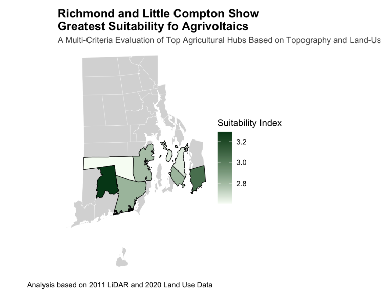

# The Technical Potential of Agrivoltaics in Rhode Island
Yale Environmental Data Science Certificate | Capstone 2025-26

## Summary
How can Rhode Island meet 100% renewable mandates while stopping the loss of farmland? By applying MCDA to analyze slope, parcel efficiency, and land cover on RIGIS land-use and LiDAR data, this study identifies Richmond and Little Compton as optimal hubs. This analysis suggests policymakers prioritize adjusting municipal ordinances to incentivize dual-use solar, effectively leveraging renewable revenue to secure long-term farmland preservation across the state’s primary agricultural hubs.

## Project Rationale: 
Rhode Island faces an acute challenge, with some of the nation's highest farmland costs ($20,000 per acre, USDA NASS) and a projected 13.7% decline in available farmland by 2040 (American Farmland Trust). At the same time, the state has set aggressive clean energy goals, legally bound to producing 100% renewable electricity by 2030 (Executive Order 20-01). 

Agrivoltaics (AV), a form of dual-use farming, integrates solar energy generation and food production on the same land, maximizing land use and creating multiple revenue streams for farmers.

AV offers a potential path to enhance food security, preserve farmland, and increase clean energy production. The feasibility of expanding agrivoltaics in RI warrants exploration as a mechanism to help secure the state's energy and food future.

## Project Question
What is the technical potential of agrivoltaics in Rhode Island as a dual-use strategy for renewable energy and farmland preservation? This investigation aims to provide a method of diversifying the state's energy production while providing farmers with financial incentives to protect prime agricultural land from commercial, industrial, urban, and suburban development.

    1. What is the total potential of available agricultural land in each municipality?
    2. What are the top seven towns with the greatest agricultural capacity and determine which have the most suitable             agricultural land cover and slope grade for solar and agricultural dual use?
    4. Which town holds the greatest potential?

## Audience
- State Policy Makers
- Town Planners
- Farms and Solar Developers

## Data Sources
All data pulled from Rhode Island GIS (https://www.rigis.org/)
- LiDAR-Derived Slope Data (2011): Raster 1-M elevation data
- Land Use/Cover Data (2020): Vector dataset. Filtering for four compatible agriculture types (idle ag, cropland, pasture, and orchard/vineyard)
- Municipality Boundaries (1997): Vector data determining town lines

## Methodology: Multi-Criteria Decision Analysis (MCDA)
The analysis utilizes a geospatial MCDA framework to identify optimal co-location zones.

## File Organization
- analysis/ - 
- archive/ - Old data and scripts
  - /archive_code/ - Old versions of scripts or "dead-end" ideas
  - /archive_data/ - Old datasets used in old scripts but notused in final analysis
- cleaning/ - cleaning, converting, reprojecting, etc. data
- data/ - Cleaned data used for final analysis
  - raw_data/ - original datasets - untouched
- metadata/ - data dictionary, variable descriptions, and process/methodology, results, and limitations description
- outputs/ - Final tables, plots, charts, maps, and markdown file
- scripts/ - Exploritory R scripts from CoCalc and RStudio

## Built With
- R in RStudio (packages: tidyverse, tidyterra, sf, terra, scales, & ggrepel)
- Minimal CoCalc usage

## Licenses
For Educational Use Only: The contents of this project are for learning and practicing purposes only.

## Contact
Author: Kayleigh Hill | Email: khillrdn@gmail.com

